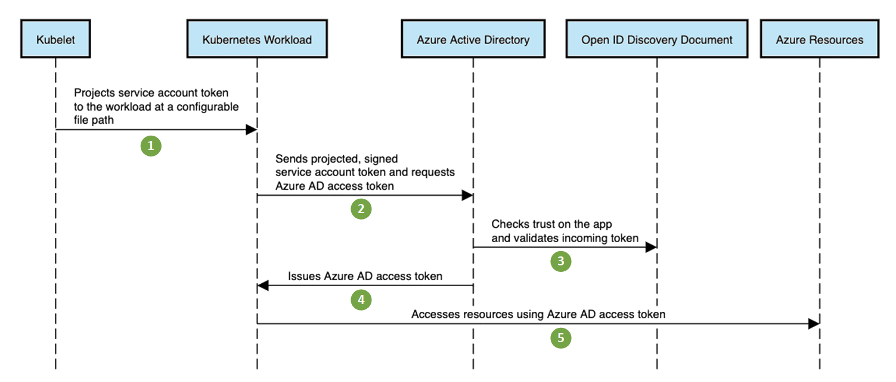
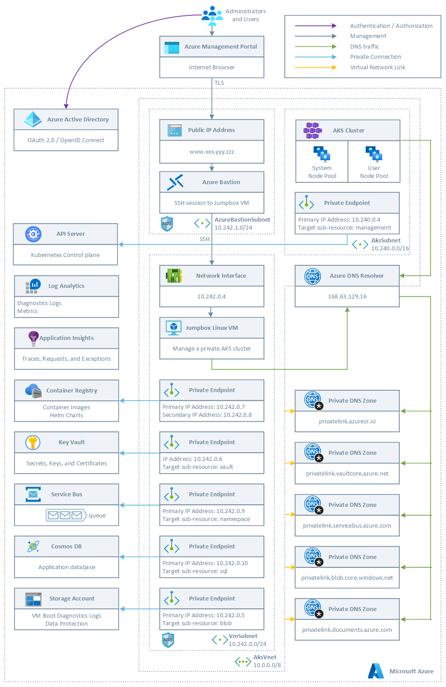
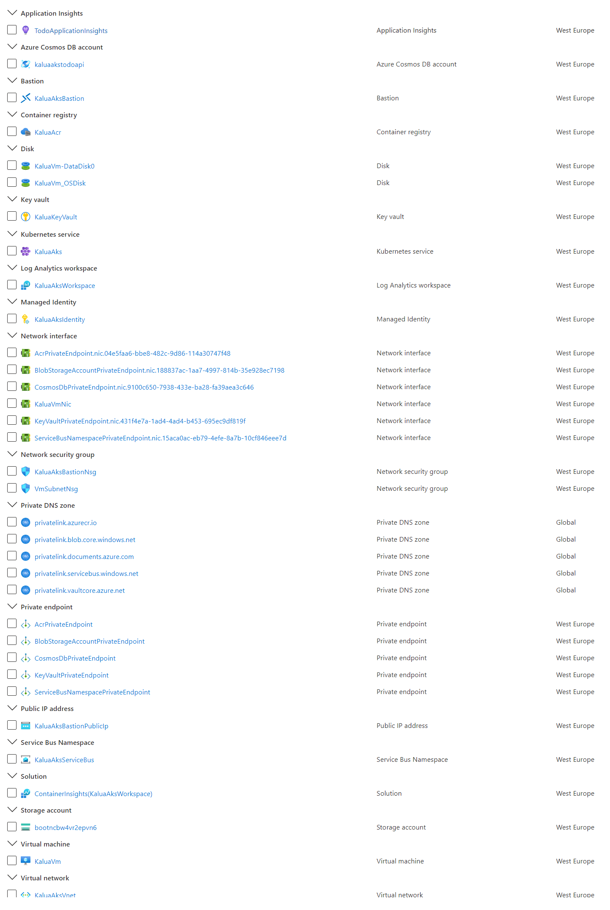
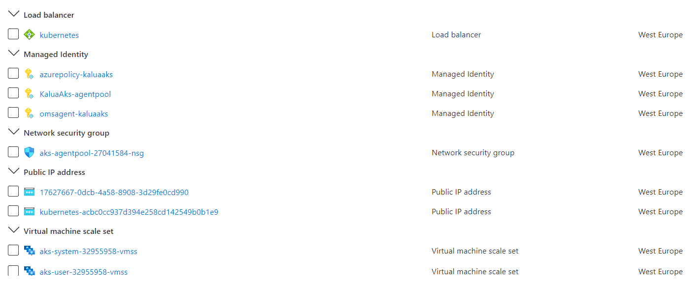
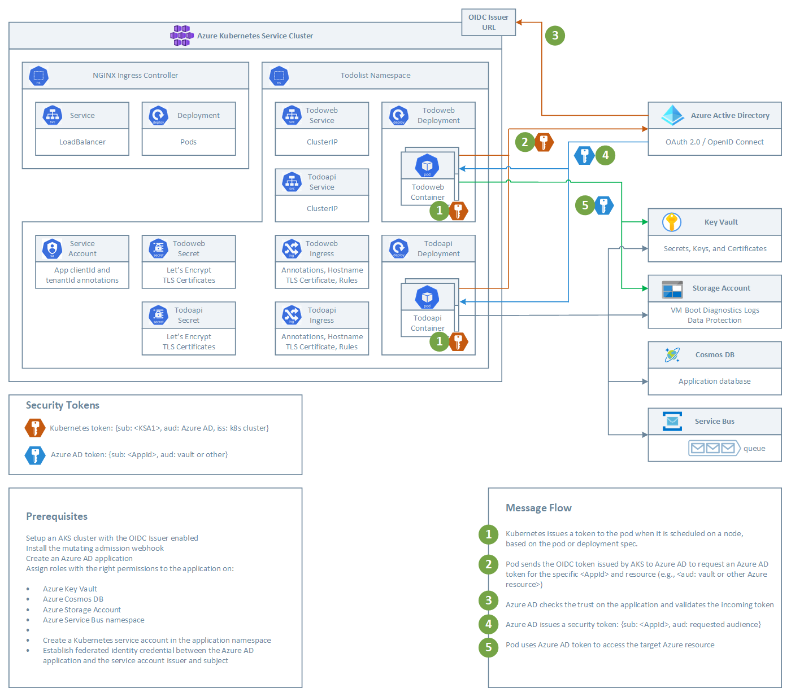
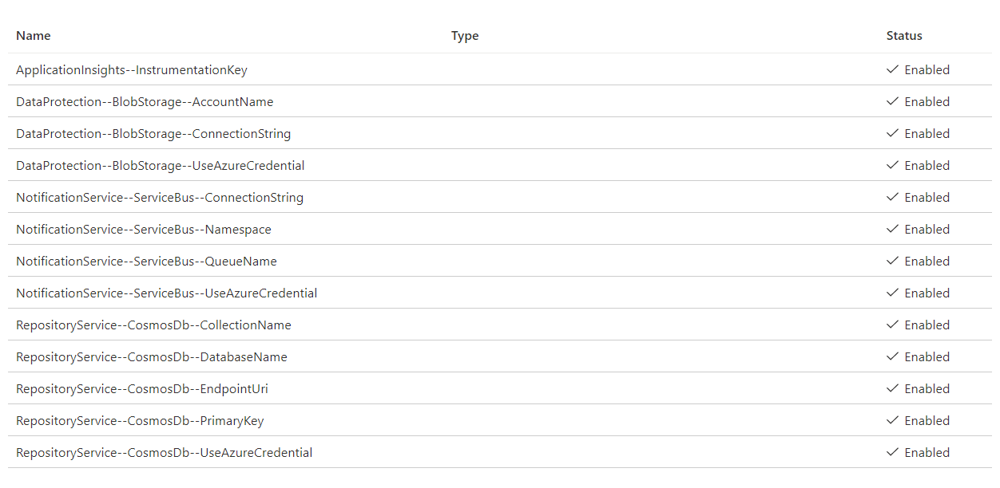
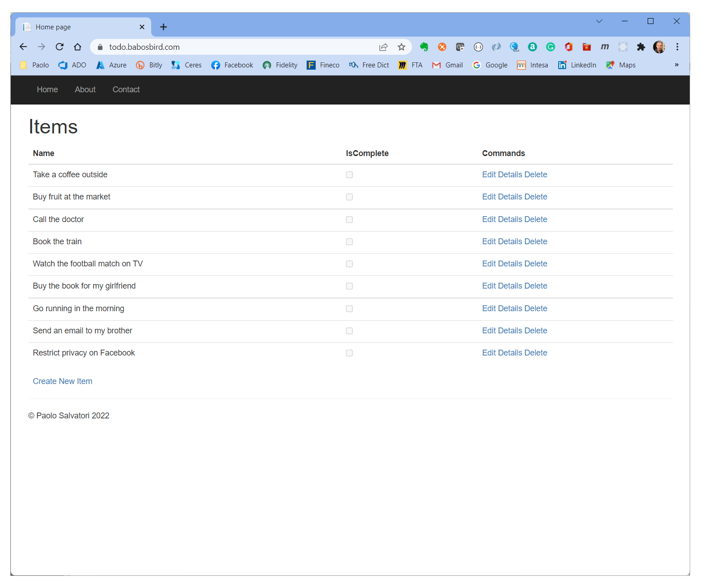
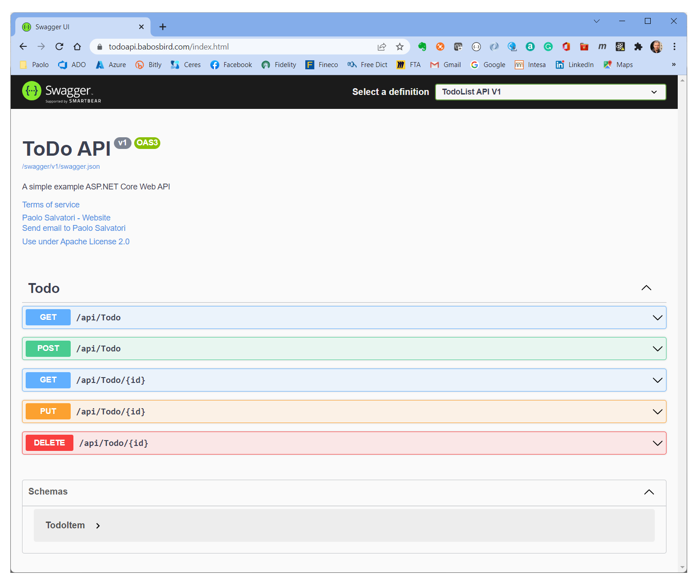

# Use Azure AD workload identity for Kubernetes in a .NET Standard application

This project shows how to use [Azure AD workload identity for Kubernetes](https://github.com/Azure/azure-workload-identity) in a [.NET Standard](https://docs.microsoft.com/en-us/dotnet/standard/net-standard?tabs=net-standard-1-0) application running on [Azure Kubernetes Service](https://docs.microsoft.com/en-us/azure/aks/intro-kubernetes). It leverages the public preview capability of [Azure AD workload identity federation](https://docs.microsoft.com/en-us/azure/active-directory/develop/workload-identity-federation).

## Azure AD Workload Identity for Kubernetes

Workloads deployed in Kubernetes clusters require Azure AD application credentials to access Azure AD protected resources, such as Azure Key Vault and Microsoft Graph. The [Azure AD Pod Identity](https://github.com/Azure/aad-pod-identity) open-source project provided a way to avoid needing these secrets, such as connection strings and primary keys, by using Azure managed identities.

[Azure AD Workload Identity for Kubernetes](https://azure.github.io/azure-workload-identity/docs/introduction.html) integrates with the Kubernetes native capabilities to federate with any external identity providers. This approach is simpler to use and deploy, and overcomes several limitations in Azure AD Pod Identity:

- Removes the scale and performance issues that existed for identity assignment
- Supports Kubernetes clusters hosted in any cloud or on-premises
- Supports both Linux and Windows workloads
- Removes the need for Custom Resource Definitions and pods that intercept Instance Metadata Service (IMDS) traffic
- Avoids the complication and error-prone installation steps such as cluster role assignment from the previous iteration.

## How does it work?

As shown in the following diagram, the Kubernetes cluster becomes a security token issuer, issuing tokens to Kubernetes Service Accounts. These tokens can be configured to be trusted on Azure AD applications. They can then be exchanged for an Azure AD access token using the [Azure Identity SDKs](https://docs.microsoft.com/en-us/dotnet/api/overview/azure/identity-readme) or the [Microsoft Authentication Library (MSAL)](https://github.com/AzureAD/microsoft-authentication-library-for-dotnet).



For more information, see the following resources:

- [Azure Workload Identity open-source project](https://azure.github.io/azure-workload-identity). 
- [Workload identity federation](https://docs.microsoft.com/azure/active-directory/develop/workload-identity-federation)
- [Azure AD workload identity federation with Kubernetes](https://blog.identitydigest.com/azuread-federate-k8s/)
- [Azure Active Directory Workload Identity Federation with external OIDC Identy Providers](https://arsenvlad.medium.com/azure-active-directory-workload-identity-federation-with-external-oidc-idp-4f06c9205a26)
- [Minimal Azure AD Workload identity federation](https://cookbook.geuer-pollmann.de/azure/workload-identity-federation)

## What is next?

Azure AD workload identity federation for Kubernetes is currently supported only on Azure AD applications. Microsoft intends to extend the same model to Azure managed identities.

In the coming months, the product group plans to replace [Azure AD Pod Identity](https://github.com/Azure/aad-pod-identity) with [Azure AD Workload Identity](https://azure.github.io/azure-workload-identity/docs/introduction.html). The goal is to let users who are already using Azure AD Pod Identity to move to Azure Workload Identity with minimal changes.

You can share any feedback or questions via GitHub [issues](https://github.com/Azure/azure-workload-identity/issues?q=is%3Aissue+is%3Aopen+sort%3Aupdated-desc) or [discussions](https://github.com/Azure/azure-workload-identity/discussions). Your support will help shape the project to meet community needs for ensuring secure access to Azure AD protected resources from Kubernetes workloads.

### Prerequisites

- For online deployments, you need an Azure account. If you don't have one, create a [free Azure account](https://azure.microsoft.com/free/?WT.mc_id=A261C142F) before you begin.
- Install [Microsoft Visual Studio 2022 or later](https://www.visualstudio.com/) with .NET Standard 6.0. For more information, see [Visual Studio Tools for Docker](https://docs.microsoft.com/en-us/aspnet/core/publishing/visual-studio-tools-for-docker).
- Install [Docker for Windows](https://docs.docker.com/docker-for-windows/install/) and configure it to use Linux containers.

## Architecture

This sample provides an ARM templates to deploy the following infrastructure on Azure. The ARM templates provides the ability to deploy a public or a private AKS cluster. In a production environment, we strongly recommend to deploy a [private AKS cluster](https://docs.microsoft.com/en-us/azure/aks/private-clusters) with [Uptime SLA](https://docs.microsoft.com/en-us/azure/aks/uptime-sla). For more information, see [private AKS cluster with a Public DNS address](https://docs.microsoft.com/en-us/azure/aks/private-clusters#create-a-private-aks-cluster-with-a-public-dns-address).



The ARM template deploys the following Azure resources:

- A private AKS cluster composed of a:
  - System node pool hosting only critical system pods and services. The worker nodes have node taint which prevents application pods from beings scheduled on this node pool.
  - User node pool hosting user workloads and artifacts.
- A new virtual network with four subnets:
  - AksSubnet: this subnet is used for the AKS cluster worker nodes. The VMSS of both the system and user node pools will be created in this subnet. You can change the ARM template to use a separate subnet for the two node pools.
  - AzureBastionSubnet: a subnet for Azure Bastion
  - VmSubnet: a subnet for the Jumpbox virtual machine used to connect to the private AKS cluster and for the private endpoints.
- A user-defined managed identity used by the AKS cluster to create additional resources like load balancers and managed disks in Azure.
- A private endpoint to the API server hosted by an AKS-managed Azure subscription. The cluster can communicate with the API server exposed via a Private Link Service using a private endpoint.
- An Azure Bastion resource that provides secure and seamless SSH connectivity to the Jumpbox virtual machine directly in the Azure portal over SSL
- An Azure Container Registry (ACR) to build, store, and manage container images and artifacts in a private registry for all types of container deployments.
- An Azure Key Vault used by the sample running on AKS to retrieve application settings stored in Key Vault as secrets.
- A private endpoint to the Blob Storage Account used to store the boot diagnostics logs or the virtual machine and the files used by the sample ASP.NET frontend and backend applications for [ASP.NET Data Protection](https://docs.microsoft.com/en-us/aspnet/core/security/data-protection/introduction?view=aspnetcore-6.0).
- A private endpoint to to Azure Container Registry (ACR)
- A private endpoint to Key Vault
- When the ACR sku is equal to Premium, a Private Endpoint is created to allow the private AKS cluster to access ACR via a private IP address. For more information, see [Connect privately to an Azure container registry using Azure Private Link](https://docs.microsoft.com/en-us/azure/container-registry/container-registry-private-link).
- A Private DNS Zone for the name resolution of the private endpoint to the Blob Storage Account
- A Private DNS Zone for the name resolution of the private endpoint to Azure Container Registry (ACR)
- A Private DNS Zone for the name resolution of the private endpoint to Key Vault
- A Virtual Network Link between the virtual network hosting the cluster and the Private DNS Zone to let the cluster to use the CNAME and A records defined by the Private DNS Zone for the name resolution of the API server of the cluster.
- A jumpbox virtual machine to manage the private AKS cluster.
- A Log Analytics workspace to collect the diagnostics logs and metrics from:
  - Azure Kubernetes Service cluster
  - Azure virtual machine
  - Azure Cosmos DB
  - Azure Key Vault
  - Azure Network Security Group
  - Azure Container Registry
  - Azure Storage Account
  - Azure Service Bus
- An Application Insights resource used by the sample application to store requests, traces, and exceptions.
- A Cosmos DB account, database, and container used by the sample application to store data.
- A Service Bus namespace and a queue where a message is sent whenever the backend application adds, deletes, or updates an item on Azure Cosmos DB.

## Visual Studio Solution

This sample provides a Visual Studio solution under the `src` folder that contains the following projects:

- `TodoWeb`: this project is an ASP.NET Web application written in C# using .NET Standard 6.0. This project contains the code of the frontend application. The user interface is composed of a set of Razor pages that can be used to browse, create, delete, update and see the details of a collection of todo items stored in a Cosmos DB database. The frontend service is configured to send logs, events, traces, requests, dependencies and exceptions to `Application Insights`.
- `TodoApi`:  this project contains the code of an ASP.NET REST API invoked by the frontend application to access the data stroed in the Cosmos DB database. Each time a CRUD operation is performed by any of the methods exposed bu the `TodoController`, the backend service sends a notification message to a `Service Bus queue`. You can use my [Service Bus Explorer](https://github.com/paolosalvatori/ServiceBusExplorer) to read messages from the queue. The frontend service is configured to send logs, events, traces, requests, dependencies and exceptions to `Application Insights`. The backend service adopts [Swagger/OpenAPI](https://swagger.io/) to expose a machine-readable representation of its RESTful API.

## Infrastructure Deployment

You can use the `deploy.sh` Bash script under the `templates` folder to deploy the infrastructure to Azure. Make sure to change the name of the AKS cluster in the `deploy.sh` Bash script and substitute the placeholders in the `azuredeploy.parameters.json` file with meaningful values. Also, make sure to enable the following public preview features before deploying the ARM template:

- [PodSecurityPolicyPreview](https://docs.microsoft.com/en-us/azure/aks/use-pod-security-policies)
- [RunCommandPreview](https://docs.microsoft.com/en-us/azure/aks/private-clusters#options-for-connecting-to-the-private-cluster)
- [EnablePodIdentityPreview](https://docs.microsoft.com/en-us/azure/aks/use-azure-ad-pod-identity)
- [EnablePrivateClusterPublicFQDN](https://docs.microsoft.com/en-us/azure/aks/private-clusters#create-a-private-aks-cluster-with-a-public-dns-address)
- [PodSubnetPreview"](https://docs.microsoft.com/en-us/azure/aks/configure-azure-cni#dynamic-allocation-of-ips-and-enhanced-subnet-support-preview)
- [AutoUpgradePreview](https://docs.microsoft.com/en-us/azure/aks/upgrade-cluster#set-auto-upgrade-channel)
- [EnableOIDCIssuerPreview](https://docs.microsoft.com/en-us/azure/aks/cluster-configuration#oidc-issuer-preview)

The `templates/deploy.sh` deployment script automatically registers the above preview features.
The following picture shows the resources deployed by the ARM template in the target resource group.



The following picture shows the resources deployed by the ARM template in the [node resource group](https://docs.microsoft.com/en-us/azure/aks/faq#why-are-two-resource-groups-created-with-aks) associated to the AKS cluster:



## Application Architecture

The following diagram shows the architecture of the application on an AKS cluster with the [OIDC Issuer](https://docs.microsoft.com/en-us/azure/aks/cluster-configuration#oidc-issuer-preview) enabled. The figure also shows how both the frontend and backend applications exchange the security tokens issued by the Kubernetes cluster to their service account with Azure AD tokens and how they use these tokens to access the following Azure AD protected resources:

- Azure Key Vault
- Azure CosmosDB
- Azure Storage Account
- Azure Service Bus



There are four steps to get the sample working end-to-end in a Kubernetes cluster:

- Cluster administrators configure the AKS cluster to issue tokens. An OIDC discovery document is published to allow validation of these tokens.
- Developers configure their deployments to use Kubernetes service accounts and get Kubernetes tokens.
- Azure AD applications are configured to trust the Kubernetes tokens.
- The Kubernetes tokens are exchanged for Azure AD tokens, and used to access Azure AD protected resources such as Azure and Microsoft Graph.

The following scripts show how you can fully automated these steps, for example in an Azure DevOps CI/CD pipeline or in a GitHub Actions workflow.

## Azure Identity SDK

The sample `Todolist` application makes use of the [Azure Identity client library for .NET](https://docs.microsoft.com/en-us/dotnet/api/overview/azure/identity-readme) with the [DefaultAzureCredential](https://docs.microsoft.com/en-us/dotnet/api/overview/azure/identity-readme#key-concepts) to authenticate via Azure AD Workload Identity and get a security token to access the following services:

- Azure Key Vault
- Azure CosmosDB
- Azure Storage Account
- Azure Service Bus

Here are some snippets from the application code that show how to access Azure resources using the [Azure Identity client library for .NET](https://docs.microsoft.com/en-us/dotnet/api/overview/azure/identity-readme) and [Azure AD workload identity for Kubernetes](https://github.com/Azure/azure-workload-identity).

### Azure Key Vault

```csharp
using Azure.Identity;
using Azure.Security.KeyVault.Secrets;

...

// Configure Key Vault configuration provider
var keyVaultUrl = $"https://{keyVaultName}.vault.azure.net/";
var secretClient = new SecretClient(new Uri(keyVaultUrl), new DefaultAzureCredential());
configurationBuilder.AddAzureKeyVault(secretClient, new KeyVaultSecretManager());

// Read configuration from Key Vault
builtConfig = configurationBuilder.Build();
```

### Azure Cosmos DB

```csharp
using Microsoft.Azure.Cosmos;
using Azure.Identity;

...

// Create CosmosClient object
_cosmosClient = new CosmosClient(
    _repositoryServiceOptions.CosmosDb.EndpointUri, 
    new DefaultAzureCredential(),
    new CosmosClientOptions
    {
        RequestTimeout = TimeSpan.FromMinutes(5),
        ConnectionMode = ConnectionMode.Gateway
    });
```

### Azure Storage Account

```csharp
using Azure.Storage.Blobs;
using Azure.Identity;

...

// Construct the blob container endpoint from the arguments.
var containerEndpoint = string.Format("https://{0}.blob.core.windows.net/{1}",
                                      accountName,
                                      containerName);
// Get a credential and create a service client object for the blob container.
containerClient = new BlobContainerClient(new Uri(containerEndpoint),
                                          new DefaultAzureCredential());
```

### Azure Service Bus

```csharp
using Azure.Messaging.ServiceBus;
using Azure.Identity;

...

// Create ServiceBusClient object
_serviceBusClient = new ServiceBusClient($"{_options.ServiceBus.Namespace}.servicebus.windows.net", new DefaultAzureCredential());
```

## Application Configuration

The ARM template also creates all the necessary secrets used by both the frontend and backend applications as shown in the picture below:



Azure Key Vault secret names are limited to alphanumeric characters and dashes. Hierarchical values in ASP.NET configuration sections use -- (two dashes) as a delimiter, as colons aren't allowed in key vault secret names. Colons delimit a section from a subkey in ASP.NET Core configuration. The two-dash sequence is replaced with a colon when the secrets are loaded into the app's configuration. For more infotmation, see [Secret storage in the Production environment with Azure Key Vault](https://docs.microsoft.com/en-us/aspnet/core/security/key-vault-configuration?view=aspnetcore-6.0#secret-storage-in-the-production-environment-with-azure-key-vault). 

The following table describes the application settings:

| Name | Description |
|:---|:---|
| ApplicationInsights--InstrumentationKey | Specifies the `Instrumentation Key` of the `Azure Application Insights` resource used by both the frontend and backend services. |
| DataProtection--BlobStorage--AccountName | Specifies the name of the `Azure Storage Account` used to store the boot diagnostics logs or the virtual machine and the files used by the sample ASP.NET frontend and backend applications for [ASP.NET Data Protection](https://docs.microsoft.com/en-us/aspnet/core/security/data-protection/introduction?view=aspnetcore-6.0). This setting is used when the `DataProtection--BlobStorage--UseAzureCredential` is set to `true`. |
| DataProtection--BlobStorage--ConnectionString | Contains the connection string to the `Azure Storage Account`. This setting is used when the `DataProtection--BlobStorage--UseAzureCredential` is set to `false`. |
| DataProtection--BlobStorage--UseAzureCredential | Specifies whether the frontend and backend services should use [Azure Identity client library for .NET](https://docs.microsoft.com/en-us/dotnet/api/overview/azure/identity-readme) with the [DefaultAzureCredential](https://docs.microsoft.com/en-us/dotnet/api/overview/azure/identity-readme#key-concepts) to authenticate via Azure AD Workload Identity and get a security token to access the `Azure Storage Account`. If the value of this setting is equal to `false`, the frontend and backend applications will use the connection string of the `Azure Storage Account` contained in the `DataProtection--BlobStorage--ConnectionString` secret. |
| NotificationService--ServiceBus--ConnectionString | Contains the connection string of the `Azure Service Bus` namespace. This setting is used when the `NotificationService--ServiceBus--UseAzureCredential` is set to `false`. |
| NotificationService--ServiceBus--Namespace | Contains the name of the `Azure Service Bus` namespace. This setting is used when the `NotificationService--ServiceBus--UseAzureCredential` is set to `true`. |
| NotificationService--ServiceBus--QueueName | Contains the name of the queue in the `Azure Service Bus` namespace where the backend service sends a message any time a todo-item is created in the `Azure Cosmos DB` database by the backend service. |
| NotificationService--ServiceBus--UseAzureCredential | Specifies whether the frontend and backend services should use [Azure Identity client library for .NET](https://docs.microsoft.com/en-us/dotnet/api/overview/azure/identity-readme) with the [DefaultAzureCredential](https://docs.microsoft.com/en-us/dotnet/api/overview/azure/identity-readme#key-concepts) to authenticate via Azure AD Workload Identity and get a security token to access the `Azure Service Bus namespace`. If the value of this setting is equal to `false`, the frontend and backend applications will use the connection string of the `Azure Service Bus namespace` contained in the `NotificationService--ServiceBus--ConnectionString` secret. |
| RepositoryService--CosmosDb--CollectionName | Specifies the name of the `Azure Cosmos DB` container. |
| RepositoryService--CosmosDb--DatabaseName | Specifies the name of the `Azure Cosmos DB` database. |
| RepositoryService--CosmosDb--EndpointUri | Specifies the endpoint URI of the `Azure Cosmos DB` account. |
| RepositoryService--CosmosDb--PrimaryKey | Contains the primary key of the `Azure Cosmos DB` account. This setting is used when the `RepositoryService--CosmosDb--UseAzureCredential` is set to `false`.  |
| RepositoryService--CosmosDb--UseAzureCredential | Specifies whether the frontend and backend services should use [Azure Identity client library for .NET](https://docs.microsoft.com/en-us/dotnet/api/overview/azure/identity-readme) with the [DefaultAzureCredential](https://docs.microsoft.com/en-us/dotnet/api/overview/azure/identity-readme#key-concepts) to authenticate via Azure AD Workload Identity and get a security token to access the `Azure Cosmos DB account`. If the value of this setting is equal to `false`, the frontend and backend applications will use the primary key of the `Azure Cosmos DB` account contained in the `RepositoryService--CosmosDb--PrimaryKey` secret. |

## Application Local Debugging

If you want to debug the application locally, you need to install [Microsoft Visual Studio 2022 or later](https://www.visualstudio.com/) with .NET Standard 6.0. For more information, see [Visual Studio Tools for Docker](https://docs.microsoft.com/en-us/aspnet/core/publishing/visual-studio-tools-for-docker). In addition, make sure to change the values in the `docker-compose.override.yml` as follows:

- You can use the same or an alternative Azure AD application to access the secrets from Key vault that contain the credentials to access the Azure Service Bus namespace, Azure Cosmos DB, and Azure Storage Account. In this case, make sure to specify the name of the Key Vault in the corresponding environment variable and assign the `List` and `Get` permissions to the Azure AD application via access policies or Azure RBAC.
- As an alternative, you can use the environment variables to specify the credentials to access the Azure Service Bus namespace, Azure Cosmos DB, and Azure Storage Account in the `docker-compose.override.yml` file (not recommended).

## Application Deployment

Run the `scripts/01-build-container-images.sh` script to build the Linux container images for the frontend and backend applications using Docker.

```bash
#!/bin/bash

#Variables
frontendContainerImageTag="<frontend-container-image-tag>"
backendContainerImageTag="<backend-container-image-tag>"

cd ../src/TodoApi
docker build -t todoapi:$frontendContainerImageTag -f Dockerfile ..
cd ../src/TodoWeb
docker build -t todoweb:$backendContainerImageTag -f Dockerfile ..
```

Run the `scripts/02-push-docker-images.sh` script to push the container images to your Azure Container Registry.

```bash
#!/bin/bash

# Variables
acrName="<acr-name>"
acrResourceGroug="<acr-resource-group>"
frontendContainerImageTag="<frontend-container-image-tag>"
backendContainerImageTag="<backend-container-image-tag>"

# Login to ACR
az acr login --name $acrName 

# Retrieve ACR login server. Each container image needs to be tagged with the loginServer name of the registry. 
loginServer=$(az acr show --name $acrName --query loginServer --output tsv)

# Tag the local todoapi image with the loginServer of ACR
docker tag todoapi:$backendContainerImageTag $loginServer/todoapi:$backendContainerImageTag

# Push todoapi container image to ACR
docker push $loginServer/todoapi:$backendContainerImageTag

# Tag the local todoweb image with the loginServer of ACR
docker tag todoweb:$frontendContainerImageTag $loginServer/todoweb:$frontendContainerImageTag

# Push todoweb container image to ACR
docker push $loginServer/todoweb:$frontendContainerImageTag
```

Run the `scripts/03-enable-oidc.sh` script on an existing AKS cluster, to register and enable the [OIDC Issuer](https://docs.microsoft.com/en-us/azure/aks/cluster-configuration#oidc-issuer-preview) feature.

```bash
#!/bin/bash

# Variables
aksClusterName="<aks-cluster-name>"
aksResourceGroupName="<aks-cluster-resource-group>"
subscriptionId=$(az account show --query id --output tsv)
subscriptionName=$(az account show --query name --output tsv)
tenantId=$(az account show --query tenantId --output tsv)

# Install aks-preview Azure extension
echo "Checking if [aks-preview] extension is already installed..."
az extension show --name aks-preview &>/dev/null

if [[ $? == 0 ]]; then
  echo "[aks-preview] extension is already installed"

  # Update the extension to make sure you have the latest version installed
  echo "Updating [aks-preview] extension..."
  az extension update --name aks-preview &>/dev/null
else
  echo "[aks-preview] extension is not installed. Installing..."

  # Install aks-preview extension
  az extension add --name aks-preview 1>/dev/null

  if [[ $? == 0 ]]; then
    echo "[aks-preview] extension successfully installed"
  else
    echo "Failed to install [aks-preview] extension"
    exit
  fi
fi

# Registering AKS feature extensions
aksExtensions=("EnableOIDCIssuer")
registeringExtensions=()
for aksExtension in ${aksExtensions[@]}; do
  echo "Checking if [$aksExtension] extension is already registered..."
  extension=$(az feature list -o table --query "[?contains(name, 'Microsoft.ContainerService/$aksExtension') && @.properties.state == 'Registered'].{Name:name}" --output tsv)
  if [[ -z $extension ]]; then
    echo "[$aksExtension] extension is not registered."
    echo "Registering [$aksExtension] extension..."
    az feature register --name $aksExtension --namespace Microsoft.ContainerService
    registeringExtensions+=("$aksExtension")
    ok=1
  else
    echo "[$aksExtension] extension is already registered."
  fi
done
delay=1
for aksExtension in ${registeringExtensions[@]}; do
  echo -n "Checking if [$aksExtension] extension is already registered..."
  while true; do
    extension=$(az feature list -o table --query "[?contains(name, 'Microsoft.ContainerService/$aksExtension') && @.properties.state == 'Registered'].{Name:name}" --output tsv)
    if [[ -z $extension ]]; then
      echo -n "."
      sleep $delay
    else
      echo "."
      break
    fi
  done
done
# Check if extensions have been successfully registered
if [[ $ok == 1 ]]; then
  echo "Refreshing the registration of the Microsoft.ContainerService resource provider..."
  az provider register --namespace Microsoft.ContainerService
  echo "Microsoft.ContainerService resource provider registration successfully refreshed"
fi

# Check if the OIDC discovery endpoint has been already enabled
echo "Check if the OIDC discovery endpoint has been already enabled on the [$aksClusterName] AKS cluster..."
enabled=$(az aks show \
  --name $aksClusterName \
  --resource-group $aksResourceGroupName \
  --query oidcIssuerProfile.enabled \
  --output tsv)

if [[ $enabled == 'true' ]]; then
  echo "The OIDC discovery endpoint has been already enabled on the [$aksClusterName] AKS cluster"
else
  echo "The OIDC discovery endpoint has not been already enabled on the [$aksClusterName] AKS cluster"
  echo "Enabling the OIDC discovery endpoint on the [$aksClusterName] AKS cluster"

  az aks update \
    --name $aksClusterName \
    --resource-group $aksResourceGroupName \
    --enable-oidc-issuer

  if [[ $? == 0 ]]; then
    echo "The OIDC discovery endpoint has been successfully enabled on the [$aksClusterName] AKS cluster"
  else
    echo "Failed to enable the OIDC discovery endpoint on the [$aksClusterName] AKS cluster"
  fi
fi

```
Run the `scripts/04-enable-mutating-admission-webhook.sh` script to install the [Azure AD Identity Workload Mutating Admission Webhook](https://azure.github.io/azure-workload-identity/docs/installation/mutating-admission-webhook.html) to your AKS cluster. Azure AD Workload Identity uses a [mutating admission webhook](https://kubernetes.io/docs/reference/access-authn-authz/admission-controllers/#mutatingadmissionwebhook) to project a signed service account token to your workload’s volume and inject the following properties to pods with a service account that is configured to use the webhook:

| Environment variable |Description |
| :--- | :--- |
| AZURE_AUTHORITY_HOST | The Azure Active Directory (AAD) endpoint. |
| AZURE_CLIENT_ID | The application/client ID of the Azure AD application. |
| AZURE_TENANT_ID | The tenant ID of the Azure account. |
| AZURE_FEDERATED_TOKEN_FILE | The path of the projected service account token file. |

| Volume | Description |
| :--- | :--- |
| azure-identity-token | The projected service account volume. |

| Volume mount | Description |
| :--- | :--- |
| /var/run/secrets/azure/tokens/azure-identity-token | The path of the projected service account token file. |

The webhook allows pods to use a [service account token](https://kubernetes.io/docs/tasks/configure-pod-container/configure-service-account/#service-account-token-volume-projection) projected to a well-known volume path to exchange for an Azure AD access token by leveraging the above properties with the Azure Identity SDKs or the [Microsoft Authentication Library (MSAL)](https://docs.microsoft.com/en-us/azure/active-directory/develop/msal-overview).

```bash
#!/bin/bash

# Variables
repoName="azure-workload-identity"
namespace="azure-workload-identity-system"
releaseName="workload-identity-webhook"
chartName="workload-identity-webhook"
repoUrl="https://azure.github.io/azure-workload-identity/charts"
subscriptionId=$(az account show --query id --output tsv)
subscriptionName=$(az account show --query name --output tsv)
tenantId=$(az account show --query tenantId --output tsv)

# Check if the repo is not already added
echo "Checking if [$repoName] has been already added..."
result=$(helm repo list | grep $repoName | awk '{print $1}')

if [[ -n $result ]]; then
    echo "[$repoName] Helm repo has been already added"
else
    # Add the Jetstack Helm repository
    echo "[$repoName] Helm repo has not been added yet"
    echo "Adding [$repoName] Helm repo..."
    helm repo add $repoName $repoUrl
fi

# Update your local Helm chart repository cache
echo 'Updating Helm repos...'
helm repo update

# Install Helm chart
result=$(helm list -n $namespace | grep $releaseName | awk '{print $1}')

if [[ -n $result ]]; then
    echo "[$releaseName] already exists in the $namespace namespace"
else
    # Install the Helm chart
    echo "Deploying [$releaseName] release to the $namespace namespace..."
    helm install $releaseName $repoName/$chartName \
        --namespace $namespace \
        --create-namespace \
        --set azureTenantID="$tenantId"
fi
```

Run the `scripts/05-install-azure-ad-workload-cli.sh` script to install the [Azure AD Workload CLI (azwi)](https://azure.github.io/azure-workload-identity/docs/installation/azwi.html). `azwi` is a utility CLI that helps manage Azure AD Workload Identity and automate error-prone operations:

- Generate the JWKS document from a list of public keys
- Streamline the creation and deletion of the following resources:
  - AAD applications
  - Kubernetes service accounts
  -Federated identities
  - Azure role assignments

```bash
#!/bin/bash

brew install Azure/azure-workload-identity/azwi
```

The ARM template automatically creates the secrets used by the fronend and backend services. Still, you can use the `scripts/06-create-key-vault-and-secrets.sh` script to create the necessary secrets to your Azure Key Vault.

```bash
#!/bin/bash

# Variables
keyVaultName="<azure-key-vault-name>"
keyVaultResourceGroupName="<azure-key-vault-resource-group-name>"
keyVaultSku="Standard"

cosmosDBAccountName="<cosmos-db-account>"
cosmosDBPrimaryKey="<cosmos-db-primary-key>"
cosmosDbUseAzureCredential="true"
cosmosDbDatabaseName="TodoApiDb"
cosmosDbCollectionName="TodoApiCollection"

serviceBusConnectionString="<service-bus-namespace-connection-string>"
serviceBusNamespace="<service-bus-namespace-name>"
serviceBusUseAzureCredential="true"
serviceBusQueueName="todoapi"

applicationInsightsInstrumentationKey="<application-insights-instrumentation-key>"

dataProtectionBlobStorageConnectionString="<storage-account-connection-string>"
dataProtectionBlobStorageAccountName="<storage-account-name>"
dataProtectionBlobStorageUseAzureCredential="true"

location="WestEurope"
subscriptionName=$(az account show --query name --output tsv)
subscriptionId=$(az account show --query id --output tsv)

# Check if the resource group already exists
echo "Checking if [$keyVaultResourceGroupName] resource group actually exists in the [$subscriptionName] subscription..."

az group show --name $keyVaultResourceGroupName &> /dev/null

if [[ $? != 0 ]]; then
    echo "No [$keyVaultResourceGroupName] resource group actually exists in the [$subscriptionName] subscription"
    echo "Creating [$keyVaultResourceGroupName] resource group in the [$subscriptionName] subscription..."
    
    # create the resource group
    az group create --name $keyVaultResourceGroupName --location $location 1> /dev/null
        
    if [[ $? == 0 ]]; then
        echo "[$keyVaultResourceGroupName] resource group successfully created in the [$subscriptionName] subscription"
    else
        echo "Failed to create [$keyVaultResourceGroupName] resource group in the [$subscriptionName] subscription"
        exit
    fi
else
    echo "[$keyVaultResourceGroupName] resource group already exists in the [$subscriptionName] subscription"
fi

# Check if the key vault already exists
echo "Checking if [$keyVaultName] key vault actually exists in the [$subscriptionName] subscription..."

az keyvault show --name $keyVaultName --resource-group $keyVaultResourceGroupName &> /dev/null

if [[ $? != 0 ]]; then
    echo "No [$keyVaultName] key vault actually exists in the [$subscriptionName] subscription"
    echo "Creating [$keyVaultName] key vault in the [$subscriptionName] subscription..."
    
    # create the key vault
    az keyvault create \
    --name $keyVaultName \
    --resource-group $keyVaultResourceGroupName \
    --location $location \
    --enabled-for-deployment \
    --enabled-for-disk-encryption \
    --enabled-for-template-deployment \
    --sku $keyVaultSku 1> /dev/null
        
    if [[ $? == 0 ]]; then
        echo "[$keyVaultName] key vault successfully created in the [$subscriptionName] subscription"
    else
        echo "Failed to create [$keyVaultName] key vault in the [$subscriptionName] subscription"
        exit
    fi
else
    echo "[$keyVaultName] key vault already exists in the [$subscriptionName] subscription"
fi

# Check if the secret already exists
cosmosDbEndpointUriSecretName="RepositoryService--CosmosDb--EndpointUri"
cosmosDbEndpointUriSecretValue="https://${cosmosDBAccountName}.documents.azure.com:443/"

echo "Checking if [$cosmosDbEndpointUriSecretName] secret actually exists in the [$keyVaultName] key vault..."

az keyvault secret show --name $cosmosDbEndpointUriSecretName --vault-name $keyVaultName &> /dev/null

if [[ $? != 0 ]]; then
    echo "No [$cosmosDbEndpointUriSecretName] secret actually exists in the [$keyVaultName] key vault"
    echo "Creating [$cosmosDbEndpointUriSecretName] secret in the [$keyVaultName] key vault..."
    
    # create the secret
    az keyvault secret set \
    --name $cosmosDbEndpointUriSecretName \
    --vault-name $keyVaultName \
    --value $cosmosDbEndpointUriSecretValue 1> /dev/null
        
    if [[ $? == 0 ]]; then
        echo "[$cosmosDbEndpointUriSecretName] secret successfully created in the [$keyVaultName] key vault"
    else
        echo "Failed to create [$cosmosDbEndpointUriSecretName] secret in the [$keyVaultName] key vault"
        exit
    fi
else
    echo "[$cosmosDbEndpointUriSecretName] secret already exists in the [$keyVaultName] key vault"
fi

# Check if the secret already exists
cosmosDbPrimaryKeySecretName="RepositoryService--CosmosDb--PrimaryKey"
cosmosDbPrimaryKeySecretValue=$cosmosDBPrimaryKey

echo "Checking if [$cosmosDbPrimaryKeySecretName] secret actually exists in the [$keyVaultName] key vault..."

az keyvault secret show --name $cosmosDbPrimaryKeySecretName --vault-name $keyVaultName &> /dev/null

if [[ $? != 0 ]]; then
    echo "No [$cosmosDbPrimaryKeySecretName] secret actually exists in the [$keyVaultName] key vault"
    echo "Creating [$cosmosDbPrimaryKeySecretName] secret in the [$keyVaultName] key vault..."
    
    # create the secret
    az keyvault secret set \
    --name $cosmosDbPrimaryKeySecretName \
    --vault-name $keyVaultName \
    --value $cosmosDbPrimaryKeySecretValue 1> /dev/null
        
    if [[ $? == 0 ]]; then
        echo "[$cosmosDbPrimaryKeySecretName] secret successfully created in the [$keyVaultName] key vault"
    else
        echo "Failed to create [$cosmosDbPrimaryKeySecretName] secret in the [$keyVaultName] key vault"
        exit
    fi
else
    echo "[$cosmosDbPrimaryKeySecretName] secret already exists in the [$keyVaultName] key vault"
fi

# Check if the secret already exists
cosmosDbUseAzureCredentialSecretName="RepositoryService--CosmosDb--UseAzureCredential"
cosmosDbUseAzureCredentialSecretValue=$cosmosDbUseAzureCredential

echo "Checking if [$cosmosDbUseAzureCredentialSecretName] secret actually exists in the [$keyVaultName] key vault..."

az keyvault secret show --name $cosmosDbUseAzureCredentialSecretName --vault-name $keyVaultName &> /dev/null

if [[ $? != 0 ]]; then
    echo "No [$cosmosDbUseAzureCredentialSecretName] secret actually exists in the [$keyVaultName] key vault"
    echo "Creating [$cosmosDbUseAzureCredentialSecretName] secret in the [$keyVaultName] key vault..."
    
    # create the secret
    az keyvault secret set \
    --name $cosmosDbUseAzureCredentialSecretName \
    --vault-name $keyVaultName \
    --value $cosmosDbUseAzureCredentialSecretValue 1> /dev/null
        
    if [[ $? == 0 ]]; then
        echo "[$cosmosDbUseAzureCredentialSecretName] secret successfully created in the [$keyVaultName] key vault"
    else
        echo "Failed to create [$cosmosDbUseAzureCredentialSecretName] secret in the [$keyVaultName] key vault"
        exit
    fi
else
    echo "[$cosmosDbUseAzureCredentialSecretName] secret already exists in the [$keyVaultName] key vault"
fi

# Check if the secret already exists
cosmosDbDatabaseNameSecretName="RepositoryService--CosmosDb--DatabaseName"
cosmosDbDatabaseNameSecretValue=$cosmosDbDatabaseName

echo "Checking if [$cosmosDbDatabaseNameSecretName] secret actually exists in the [$keyVaultName] key vault..."

az keyvault secret show --name $cosmosDbDatabaseNameSecretName --vault-name $keyVaultName &> /dev/null

if [[ $? != 0 ]]; then
    echo "No [$cosmosDbDatabaseNameSecretName] secret actually exists in the [$keyVaultName] key vault"
    echo "Creating [$cosmosDbDatabaseNameSecretName] secret in the [$keyVaultName] key vault..."
    
    # create the secret
    az keyvault secret set \
    --name $cosmosDbDatabaseNameSecretName \
    --vault-name $keyVaultName \
    --value $cosmosDbDatabaseNameSecretValue 1> /dev/null
        
    if [[ $? == 0 ]]; then
        echo "[$cosmosDbDatabaseNameSecretName] secret successfully created in the [$keyVaultName] key vault"
    else
        echo "Failed to create [$cosmosDbDatabaseNameSecretName] secret in the [$keyVaultName] key vault"
        exit
    fi
else
    echo "[$cosmosDbDatabaseNameSecretName] secret already exists in the [$keyVaultName] key vault"
fi

# Check if the secret already exists
cosmosDbCollectionNameSecretName="RepositoryService--CosmosDb--CollectionName"
cosmosDbCollectionNameSecretValue=$cosmosDbCollectionName

echo "Checking if [$cosmosDbCollectionNameSecretName] secret actually exists in the [$keyVaultName] key vault..."

az keyvault secret show --name $cosmosDbCollectionNameSecretName --vault-name $keyVaultName &> /dev/null

if [[ $? != 0 ]]; then
    echo "No [$cosmosDbCollectionNameSecretName] secret actually exists in the [$keyVaultName] key vault"
    echo "Creating [$cosmosDbCollectionNameSecretName] secret in the [$keyVaultName] key vault..."
    
    # create the secret
    az keyvault secret set \
    --name $cosmosDbCollectionNameSecretName \
    --vault-name $keyVaultName \
    --value $cosmosDbCollectionNameSecretValue 1> /dev/null
        
    if [[ $? == 0 ]]; then
        echo "[$cosmosDbCollectionNameSecretName] secret successfully created in the [$keyVaultName] key vault"
    else
        echo "Failed to create [$cosmosDbCollectionNameSecretName] secret in the [$keyVaultName] key vault"
        exit
    fi
else
    echo "[$cosmosDbCollectionNameSecretName] secret already exists in the [$keyVaultName] key vault"
fi

# Check if the secret already exists
serviceBusConnectionStringSecretName="NotificationService--ServiceBus--ConnectionString"
serviceBusConnectionStringSecretValue=$serviceBusConnectionString

echo "Checking if [$serviceBusConnectionStringSecretName] secret actually exists in the [$keyVaultName] key vault..."

az keyvault secret show --name $serviceBusConnectionStringSecretName --vault-name $keyVaultName &> /dev/null

if [[ $? != 0 ]]; then
    echo "No [$serviceBusConnectionStringSecretName] secret actually exists in the [$keyVaultName] key vault"
    echo "Creating [$serviceBusConnectionStringSecretName] secret in the [$keyVaultName] key vault..."
    
    # create the secret
    az keyvault secret set \
    --name $serviceBusConnectionStringSecretName \
    --vault-name $keyVaultName \
    --value $serviceBusConnectionStringSecretValue 1> /dev/null
        
    if [[ $? == 0 ]]; then
        echo "[$serviceBusConnectionStringSecretName] secret successfully created in the [$keyVaultName] key vault"
    else
        echo "Failed to create [$serviceBusConnectionStringSecretName] secret in the [$keyVaultName] key vault"
        exit
    fi
else
    echo "[$serviceBusConnectionStringSecretName] secret already exists in the [$keyVaultName] key vault"
fi

# Check if the secret already exists
serviceBusNamespaceSecretName="NotificationService--ServiceBus--Namespace"
serviceBusNamespaceSecretValue=$serviceBusNamespace

echo "Checking if [$serviceBusNamespaceSecretName] secret actually exists in the [$keyVaultName] key vault..."

az keyvault secret show --name $serviceBusNamespaceSecretName --vault-name $keyVaultName &> /dev/null

if [[ $? != 0 ]]; then
    echo "No [$serviceBusNamespaceSecretName] secret actually exists in the [$keyVaultName] key vault"
    echo "Creating [$serviceBusNamespaceSecretName] secret in the [$keyVaultName] key vault..."
    
    # create the secret
    az keyvault secret set \
    --name $serviceBusNamespaceSecretName \
    --vault-name $keyVaultName \
    --value $serviceBusNamespaceSecretValue 1> /dev/null
        
    if [[ $? == 0 ]]; then
        echo "[$serviceBusNamespaceSecretName] secret successfully created in the [$keyVaultName] key vault"
    else
        echo "Failed to create [$serviceBusNamespaceSecretName] secret in the [$keyVaultName] key vault"
        exit
    fi
else
    echo "[$serviceBusNamespaceSecretName] secret already exists in the [$keyVaultName] key vault"
fi

# Check if the secret already exists
serviceBusUseAzureCredentialSecretName="NotificationService--ServiceBus--UseAzureCredential"
serviceBusUseAzureCredentialSecretValue=$serviceBusUseAzureCredential

echo "Checking if [$serviceBusUseAzureCredentialSecretName] secret actually exists in the [$keyVaultName] key vault..."

az keyvault secret show --name $serviceBusUseAzureCredentialSecretName --vault-name $keyVaultName &> /dev/null

if [[ $? != 0 ]]; then
    echo "No [$serviceBusUseAzureCredentialSecretName] secret actually exists in the [$keyVaultName] key vault"
    echo "Creating [$serviceBusUseAzureCredentialSecretName] secret in the [$keyVaultName] key vault..."
    
    # create the secret
    az keyvault secret set \
    --name $serviceBusUseAzureCredentialSecretName \
    --vault-name $keyVaultName \
    --value $serviceBusUseAzureCredentialSecretValue 1> /dev/null
        
    if [[ $? == 0 ]]; then
        echo "[$serviceBusUseAzureCredentialSecretName] secret successfully created in the [$keyVaultName] key vault"
    else
        echo "Failed to create [$serviceBusUseAzureCredentialSecretName] secret in the [$keyVaultName] key vault"
        exit
    fi
else
    echo "[$serviceBusUseAzureCredentialSecretName] secret already exists in the [$keyVaultName] key vault"
fi

# Check if the secret already exists
serviceBusQueueNameSecretName="NotificationService--ServiceBus--QueueName"
serviceBusQueueNameSecretValue=$serviceBusQueueName

echo "Checking if [$serviceBusQueueNameSecretName] secret actually exists in the [$keyVaultName] key vault..."

az keyvault secret show --name $serviceBusQueueNameSecretName --vault-name $keyVaultName &> /dev/null

if [[ $? != 0 ]]; then
    echo "No [$serviceBusQueueNameSecretName] secret actually exists in the [$keyVaultName] key vault"
    echo "Creating [$serviceBusQueueNameSecretName] secret in the [$keyVaultName] key vault..."
    
    # create the secret
    az keyvault secret set \
    --name $serviceBusQueueNameSecretName \
    --vault-name $keyVaultName \
    --value $serviceBusQueueNameSecretValue 1> /dev/null
        
    if [[ $? == 0 ]]; then
        echo "[$serviceBusQueueNameSecretName] secret successfully created in the [$keyVaultName] key vault"
    else
        echo "Failed to create [$serviceBusQueueNameSecretName] secret in the [$keyVaultName] key vault"
        exit
    fi
else
    echo "[$serviceBusQueueNameSecretName] secret already exists in the [$keyVaultName] key vault"
fi

# Check if the secret already exists
applicationInsightsInstrumentationKeySecretName="ApplicationInsights--InstrumentationKey"
applicationInsightsInstrumentationKeySecretValue=$applicationInsightsInstrumentationKey

echo "Checking if [$applicationInsightsInstrumentationKeySecretName] secret actually exists in the [$keyVaultName] key vault..."

az keyvault secret show --name $applicationInsightsInstrumentationKeySecretName --vault-name $keyVaultName &> /dev/null

if [[ $? != 0 ]]; then
    echo "No [$applicationInsightsInstrumentationKeySecretName] secret actually exists in the [$keyVaultName] key vault"
    echo "Creating [$applicationInsightsInstrumentationKeySecretName] secret in the [$keyVaultName] key vault..."
    
    # create the secret
    az keyvault secret set \
    --name $applicationInsightsInstrumentationKeySecretName \
    --vault-name $keyVaultName \
    --value $applicationInsightsInstrumentationKeySecretValue 1> /dev/null
        
    if [[ $? == 0 ]]; then
        echo "[$applicationInsightsInstrumentationKeySecretName] secret successfully created in the [$keyVaultName] key vault"
    else
        echo "Failed to create [$applicationInsightsInstrumentationKeySecretName] secret in the [$keyVaultName] key vault"
        exit
    fi
else
    echo "[$applicationInsightsInstrumentationKeySecretName] secret already exists in the [$keyVaultName] key vault"
fi

# Check if the secret already exists
dataProtectionBlobStorageConnectionStringSecretName="DataProtection--BlobStorage--ConnectionString"
dataProtectionBlobStorageConnectionStringSecretValue=$dataProtectionBlobStorageConnectionString

echo "Checking if [$dataProtectionBlobStorageConnectionStringSecretName] secret actually exists in the [$keyVaultName] key vault..."

az keyvault secret show --name $dataProtectionBlobStorageConnectionStringSecretName --vault-name $keyVaultName &> /dev/null

if [[ $? != 0 ]]; then
    echo "No [$dataProtectionBlobStorageConnectionStringSecretName] secret actually exists in the [$keyVaultName] key vault"
    echo "Creating [$dataProtectionBlobStorageConnectionStringSecretName] secret in the [$keyVaultName] key vault..."
    
    # create the secret
    az keyvault secret set \
    --name $dataProtectionBlobStorageConnectionStringSecretName \
    --vault-name $keyVaultName \
    --value $dataProtectionBlobStorageConnectionStringSecretValue 1> /dev/null
        
    if [[ $? == 0 ]]; then
        echo "[$dataProtectionBlobStorageConnectionStringSecretName] secret successfully created in the [$keyVaultName] key vault"
    else
        echo "Failed to create [$dataProtectionBlobStorageConnectionStringSecretName] secret in the [$keyVaultName] key vault"
        exit
    fi
else
    echo "[$dataProtectionBlobStorageConnectionStringSecretName] secret already exists in the [$keyVaultName] key vault"
fi

# Check if the secret already exists
dataProtectionBlobStorageAccountNameSecretName="DataProtection--BlobStorage--AccountName"
dataProtectionBlobStorageAccountNameSecretValue=$dataProtectionBlobStorageAccountName

echo "Checking if [$dataProtectionBlobStorageAccountNameSecretName] secret actually exists in the [$keyVaultName] key vault..."

az keyvault secret show --name $dataProtectionBlobStorageAccountNameSecretName --vault-name $keyVaultName &> /dev/null

if [[ $? != 0 ]]; then
    echo "No [$dataProtectionBlobStorageAccountNameSecretName] secret actually exists in the [$keyVaultName] key vault"
    echo "Creating [$dataProtectionBlobStorageAccountNameSecretName] secret in the [$keyVaultName] key vault..."
    
    # create the secret
    az keyvault secret set \
    --name $dataProtectionBlobStorageAccountNameSecretName \
    --vault-name $keyVaultName \
    --value $dataProtectionBlobStorageAccountNameSecretValue 1> /dev/null
        
    if [[ $? == 0 ]]; then
        echo "[$dataProtectionBlobStorageAccountNameSecretName] secret successfully created in the [$keyVaultName] key vault"
    else
        echo "Failed to create [$dataProtectionBlobStorageAccountNameSecretName] secret in the [$keyVaultName] key vault"
        exit
    fi
else
    echo "[$dataProtectionBlobStorageAccountNameSecretName] secret already exists in the [$keyVaultName] key vault"
fi

# Check if the secret already exists
dataProtectionBlobStorageUseAzureCredentialSecretName="DataProtection--BlobStorage--UseAzureCredential"
dataProtectionBlobStorageUseAzureCredentialSecretValue=$dataProtectionBlobStorageUseAzureCredential

echo "Checking if [$dataProtectionBlobStorageUseAzureCredentialSecretName] secret actually exists in the [$keyVaultName] key vault..."

az keyvault secret show --name $dataProtectionBlobStorageUseAzureCredentialSecretName --vault-name $keyVaultName &> /dev/null

if [[ $? != 0 ]]; then
    echo "No [$dataProtectionBlobStorageUseAzureCredentialSecretName] secret actually exists in the [$keyVaultName] key vault"
    echo "Creating [$dataProtectionBlobStorageUseAzureCredentialSecretName] secret in the [$keyVaultName] key vault..."
    
    # create the secret
    az keyvault secret set \
    --name $dataProtectionBlobStorageUseAzureCredentialSecretName \
    --vault-name $keyVaultName \
    --value $dataProtectionBlobStorageUseAzureCredentialSecretValue 1> /dev/null
        
    if [[ $? == 0 ]]; then
        echo "[$dataProtectionBlobStorageUseAzureCredentialSecretName] secret successfully created in the [$keyVaultName] key vault"
    else
        echo "Failed to create [$dataProtectionBlobStorageUseAzureCredentialSecretName] secret in the [$keyVaultName] key vault"
        exit
    fi
else
    echo "[$dataProtectionBlobStorageUseAzureCredentialSecretName] secret already exists in the [$keyVaultName] key vault"
fi
```

The next step consists in creating an Azure AD application and granting permissions to:

- Get and list secrets in Azure Key Vault
- Read and write data in Azure Cosmos DB
- Read and write blobs in the Azure Storage Account
- Send and receive messages to queues in a Service Bus namespace

You can run the `scripts/07-create-aad-application.sh` script to create the Azure AD application and grant permissions.

```bash
#!/bin/bash

# Variables
applicationName="<aad-application-name>" 
keyVaultName="<key-vault-name>"
keyVaultResourceGroupName="<key-vault-resource-group>"
storageAccountName="<storage-account-name>"
cosmosDbAccountName="<cosmos-db-account-name>"
cosmosDbAccountResourceGroupName="<cosmos-db-resource-group-name>"
serviceBusNamespace="<service-bus-namespace-name>"
serviceBusResourceGroupName="service-bus-resource-group-name>"
tenantId=$(az account show --query tenantId --output tsv)

# Create Azure Active Directory Application
echo "Checking if an AAD application with [$applicationName] display name already exists in the [$tenantId] tenant..."
displayName=$(az ad sp list \
  --display-name $applicationName \
  --query [].appDisplayName \
  --output tsv)

if [[ -z $displayName ]]; then
  echo "No AAD application with [$applicationName] display name exists in the [$tenantId] tenant"
  echo "Creating AAD application with [$applicationName] display name exists in the [$tenantId] tenant..."

  # Create AAD application
  az ad sp create-for-rbac --name $applicationName

  if [[ $? == 0 ]]; then
    echo "AAD application with [$applicationName] display name successfully created in the [$tenantId] tenant"
  else
    echo "Failed to create an AAD application with [$applicationName] display name in the [$tenantId] tenant"
  fi
else
  echo "An AAD application with [$applicationName] display name already exists in the [$tenantId] tenant"
  # {
  #   "appId": "82dc4dd8-cd7d-4f4f-8b0f-6aa47ee66665",
  #   "displayName": "BaboOidc",
  #   "password": "4AthjN6aI-iSV3F8O8olwv4js6R9fUVpuT",
  #   "tenant": "72f988bf-86f1-41af-91ab-2d7cd011db47"
  # }
fi

# Get the appId of the AAD application
echo "Getting the appId of the AAD application with [$applicationName] display name..."
appId=$(az ad sp list \
  --display-name $applicationName \
  --query [].appId \
  --output tsv)

if [[ -n $appId ]]; then
  echo "[$appId] appId successfully retrieved"
else
  echo "Failed to retrieve the appId of the AAD application with [$applicationName] display name"
  exit -1
fi

# Get the objectId of the AAD application
echo "Getting the objectId of the service principal associated to the AAD application with [$applicationName] display name..."
objectId=$(az ad sp show  \
  --id $appId \
  --query objectId \
  --output tsv)

if [[ -n $objectId ]]; then
  echo "[$objectId] objectId successfully retrieved"
else
  echo "Failed to retrieve the objectId of the AAD application with [$applicationName] display name"
  exit -1
fi

# Create Key Vault access policy for the AAD application
echo "Setting the access policy for AAD application with [$applicationName] display name on the [$keyVaultName] key vault..."
az keyvault set-policy --name $keyVaultName \
  --secret-permissions get list \
  --spn $appId &>/dev/null

if [[ $? == 0 ]]; then
  echo "Access policy successfully set for the AAD application with [$applicationName] display name on the [$keyVaultName] key vault"
else
  echo "Failed to set the access policy for the AAD application with [$applicationName] display name on the [$keyVaultName] key vault"
fi

# Get storage account resource id
storageAccountId=$(az storage account show \
  --name $storageAccountName \
  --query id \
  --output tsv)

if [[ -n $storageAccountId ]]; then
  echo "Resource id for the [$storageAccountName] storage account successfully retrieved"
else
  echo "Failed to the resource id for the [$storageAccountName] storage account"
  exit -1
fi

# Assign the Storage Blob Data Contributor role to the service principal of the AAD application with the storage account as scope
role="Storage Blob Data Contributor"
echo "Checking if service principal of the [$applicationName] AAD application has been assigned to [$role] role with [$storageAccountName] storage account as scope..."
current=$(az role assignment list \
  --assignee $appId \
  --scope $storageAccountId \
  --query "[?roleDefinitionName=='$role'].roleDefinitionName" \
  --output tsv 2>/dev/null)

if [[ $current == $role ]]; then
  echo "Service principal of the [$applicationName] AAD application is already assigned to the ["$current"] role with [$storageAccountName] storage account as scope"
else
  echo "Service principal of the [$applicationName] AAD application is not assigned to the [$role] role with [$storageAccountName] storage account as scope"
  echo "Assigning the service principal of the [$applicationName] AAD application to the [$role] role with [$storageAccountName] storage account as scope..."

  az role assignment create \
    --assignee $appId \
    --role "$role" \
    --scope $storageAccountId 1>/dev/null

  if [[ $? == 0 ]]; then
    echo "Service principal of the [$applicationName] AAD application successfully assigned to the [$role] role with [$storageAccountName] storage account as scope"
  else
    echo "Failed to assign the service principal of the [$applicationName] AAD application to the [$role] role with [$storageAccountName] storage account as scope"
    exit
  fi
fi

# Assign the Cosmos DB Built-in Data Contributor role to the service principal of the AAD application with the Cosmos DB accout as scope
role="Cosmos DB Built-in Data Contributor"
roleId="00000000-0000-0000-0000-000000000002"
echo "Checking if service principal of the [$applicationName] AAD application has been assigned to [$role] role with [$cosmosDbAccountName] Cosmos DB account as scope..."
current=$(az cosmosdb sql role assignment list \
  --account-name $cosmosDbAccountName \
  --resource-group $cosmosDbAccountResourceGroupName \
  --query "[?principalId=='$objectId'].roleDefinitionId" \
  --output tsv)

if [[ -n $current ]]; then
  echo "Service principal of the [$applicationName] AAD application is already assigned to the ["$role"] role with [$cosmosDbAccountName] Cosmos DB account as scope"
else
  echo "Service principal of the [$applicationName] AAD application is not assigned to the [$role] role with [$cosmosDbAccountName] Cosmos DB account as scope"
  echo "Assigning the service principal of the [$applicationName] AAD application to the [$role] role with [$cosmosDbAccountName] Cosmos DB account as scope..."

  az cosmosdb sql role assignment create \
    --account-name $cosmosDbAccountName \
    --resource-group $cosmosDbAccountResourceGroupName \
    --scope "/" \
    --principal-id $objectId \
    --role-definition-id "$roleId" 1>/dev/null

  if [[ $? == 0 ]]; then
    echo "Service principal of the [$applicationName] AAD application successfully assigned to the [$role] role with [$cosmosDbAccountName] Cosmos DB account as scope"
  else
    echo "Failed to assign the service principal of the [$applicationName] AAD application to the [$role] role with [$cosmosDbAccountName] Cosmos DB account as scope"
    exit
  fi
fi

# Get Service Bus namespace resource id
serviceBusNamespaceId=$(az servicebus namespace show \
  --name $serviceBusNamespace \
  --resource-group $serviceBusResourceGroupName \
  --query id \
  --output tsv)

if [[ -n $serviceBusNamespaceId ]]; then
  echo "Resource id for the [$serviceBusNamespace] Service Bus namespace successfully retrieved"
else
  echo "Failed to the resource id for the [$serviceBusNamespace] Service Bus namespace"
  exit -1
fi

# Assign the Azure Service Bus Data Owner role to the service principal of the AAD application with the Service Bus namespace as scope
role="Azure Service Bus Data Owner"
echo "Checking if service principal of the [$applicationName] AAD application has been assigned to [$role] role with [$serviceBusNamespace] Service Bus namespace as scope..."
current=$(az role assignment list \
  --assignee $appId \
  --scope $serviceBusNamespaceId \
  --query "[?roleDefinitionName=='$role'].roleDefinitionName" \
  --output tsv 2>/dev/null)

if [[ -n $current ]]; then
  echo "Service principal of the [$applicationName] AAD application is already assigned to the ["$current"] role with [$serviceBusNamespace] Service Bus namespace as scope"
else
  echo "Service principal of the [$applicationName] AAD application is not assigned to the [$role] role with [$serviceBusNamespace] Service Bus namespace as scope"
  echo "Assigning the service principal of the [$applicationName] AAD application to the [$role] role with [$serviceBusNamespace] Service Bus namespace as scope..."

  az role assignment create \
    --assignee $appId \
    --role "$role" \
    --scope $serviceBusNamespaceId 1>/dev/null

  if [[ $? == 0 ]]; then
    echo "Service principal of the [$applicationName] AAD application successfully assigned to the [$role] role with [$serviceBusNamespace] Service Bus namespace as scope"
  else
    echo "Failed to assign the service principal of the [$applicationName] AAD application to the [$role] role with [$serviceBusNamespace] Service Bus namespace as scope"
    exit
  fi
fi

```

You can use the `scripts/08-create-service-account.sh` script to create a Kubernetes service account in the application namespace and annotate it with the client ID of the Azure AD application. The last step of the script establishes federated identity credential between the AAD application and the service account issuer and subject. This service account is used by the Kubernetes deployment of both the frontend and backend services. For more details, see the `scripts/todolist.yml` YAML manifest or the Helm chart under the `chart` folder.

```bash
#!/bin/bash

# Variables
aksClusterName="<aks-cluster-name>"
aksResourceGroupName="<aks-cluster-resource-group>"
namespace="todolist"
serviceAccountName="todolist-identity-sa"
applicationName="<aad-application-name>" 
tenantId=$(az account show --query tenantId --output tsv)
useAzwi=0

# Get the OIDC service account issuer URL
oidcIssuerUrl=$(az aks show \
  --name $aksClusterName \
  --resource-group $aksResourceGroupName \
  --query oidcIssuerProfile.issuerUrl \
  --output tsv)

if [[ -n $oidcIssuerUrl ]]; then
  echo "[$oidcIssuerUrl] OIDC service account issuer URL successfully retrieved for the [$aksClusterName] AKS cluster"
else
  echo "Failed to retrieve the OIDC service account issuer URL for the [$aksClusterName] AKS cluster"
  exit -1
fi

# Get the appId of the AAD application
echo "Getting the appId of the AAD application with [$applicationName] display name..."
appId=$(az ad sp list \
  --display-name $applicationName \
  --query [].appId \
  --output tsv)

if [[ -n $appId ]]; then
  echo "[$appId] appId successfully retrieved"
else
  echo "Failed to retrieve the appId of the AAD application with [$applicationName] display name"
  exit -1
fi

# Get the objectId of the AAD application
echo "Getting the objectId of the AAD application with [$applicationName] display name..."
objectId=$(az ad app show \
  --id $appId \
  --query objectId \
  --output tsv)

if [[ -n $objectId ]]; then
  echo "[$objectId] objectId successfully retrieved"
else
  echo "Failed to retrieve the objectId of the AAD application with [$applicationName] display name"
  exit -1
fi

# Check if the namespace exists in the cluster
echo "Checking if the [$namespace] namespace already exists..."
result=$(kubectl get ns -o jsonpath="{.items[?(@.metadata.name=='$namespace')].metadata.name}")

if [[ -n $result ]]; then
  echo "[$namespace] namespace already exists in the cluster"
else
  echo "[$namespace] namespace does not exist in the cluster"
  echo "Creating [$namespace] namespace in the cluster..."

  # Create the namespace
  kubectl create namespace $namespace
fi

# Check if the service account exists in the namespace
echo "Checking if the [$serviceAccountName] service account already exists in the [$namespace] namespace..."
result=$(kubectl get serviceaccount -n $namespace -o jsonpath="{.items[?(@.metadata.name=='$serviceAccountName')].metadata.name}")

if [[ -n $result ]]; then
  echo "[$serviceAccountName] service account already exists in the [$namespace] namespace"
else
  echo "[$serviceAccountName] service account does not exist in the [$namespace] namespace"
  echo "Creating [$serviceAccountName] service account in the [$namespace] namespace..."

  # Create the service account
  if [[ $useAzwi == 0 ]]; then
    cat <<EOF | kubectl apply -f -
apiVersion: v1
kind: ServiceAccount
metadata:
  name: ${serviceAccountName}
  namespace: ${namespace}
  annotations:
    azure.workload.identity/client-id: ${appId}
    azure.workload.identity/tenant-id: ${tenantId}
  labels:
    azure.workload.identity/use: "true"
EOF
  else
    azwi serviceaccount create phase sa \
      --aad-application-name "${applicationName}" \
      --service-account-namespace "${namespace}" \
      --service-account-name "${serviceAccountName}"
  fi
fi

# Delete any existing body.json from the current folder
if [[ -f body.json ]]; then
  rm body.json
fi

# Establish federated identity credential between the AAD application and the service account issuer & subject
echo "Establishing federated identity credential between the [$applicationName] AAD application and the [$serviceAccountName] service account issuer & subject..."
if [[ $useAzwi == 0 ]]; then
  cat <<EOF >body.json
{
  "name": "kubernetes-federated-credential",
  "issuer": "${oidcIssuerUrl}",
  "subject": "system:serviceaccount:${namespace}:${serviceAccountName}",
  "description": "Kubernetes service account federated credential",
  "audiences": [
    "api://AzureADTokenExchange"
  ]
}
EOF
  az rest \
    --method POST \
    --uri "https://graph.microsoft.com/beta/applications/$objectId/federatedIdentityCredentials" \
    --body @body.json 1>/dev/null
  
  if [[ $? == 0 ]]; then
    echo "Federated identity credential successfully established between the [$applicationName] AAD application and the [$serviceAccountName] service account issuer & subject"
  else
    echo "Failed to establish federated identity credential between the [$applicationName] AAD application and the [$serviceAccountName] service account issuer & subject"
  fi
else
  azwi serviceaccount create phase federated-identity \
    --aad-application-name "$applicationName" \
    --service-account-namespace "$namespace}" \
    --service-account-name "$serviceAccountName" \
    --service-account-issuer-url "$oidcIssuerUrl"
  if [[ $? == 0 ]]; then
    echo "Federated identity credential successfully established between the [$applicationName] AAD application and the [$serviceAccountName] service account issuer & subject"
  else
    echo "Failed to establish federated identity credential between the [$applicationName] AAD application and the [$serviceAccountName] service account issuer & subject"
  fi
fi

# Delete any existing body.json from the current folder
if [[ -f body.json ]]; then
  rm body.json
fi
```

You can use the `scripts/09-create-nginx-ingress-controller.sh` script to install the [NGINX Ingress Controller](https://docs.nginx.com/nginx-ingress-controller/) on your AKS cluster via a [Helm](https://helm.sh/) chart. NGINX Ingress controller works with both NGINX and NGINX Plus and supports the standard Ingress features - content-based routing and TLS/SSL termination. In this sample, the NGINX Ingress controller is used to publicly expose both the frontend and backend service. Normally, the backend service should not be directly exposed to the public internet, but for demo purpose, the REST API is publicly exposed.

```bash
#!/bin/bash

# Variables
namespace="ingress-basic"
repoName="ingress-nginx"
repoUrl="https://kubernetes.github.io/ingress-nginx"
chartName="ingress-nginx"
releaseName="nginx-ingress"
replicaCount=2

# Install jq if not installed
path=$(which jq)

if [[ -z $path ]]; then
    echo 'Installing jq...'
    apt install -y jq
fi

# Check if the namespace already exists in the cluster
result=$(kubectl get namespace -o 'jsonpath={.items[?(@.metadata.name=="'$namespace'")].metadata.name'})

if [[ -n $result ]]; then
    echo "[$namespace] namespace already exists in the cluster"
else
    # Create the namespace for your ingress resources
    echo "[$namespace] namespace does not exist in the cluster"
    echo "Creating [$namespace] namespace in the cluster..."
    kubectl create namespace $namespace
fi

# Check if the ingress-nginx repository is not already added
result=$(helm repo list | grep $repoName | awk '{print $1}')

if [[ -n $result ]]; then
    echo "[$repoName] Helm repo already exists"
else
    # Add the ingress-nginx repository
    echo "Adding [$repoName] Helm repo..."
    helm repo add $repoName $repoUrl
fi

# Use Helm to deploy an NGINX ingress controller
result=$(helm list -n $namespace | grep $releaseName | awk '{print $1}')

if [[ -n $result ]]; then
    echo "[$releaseName] ingress controller already exists in the [$namespace] namespace"
else
    # Deploy NGINX ingress controller
    echo "Deploying [$releaseName] NGINX ingress controller to the [$namespace] namespace..."
    helm install $releaseName $repoName/$chartName \
        --namespace $namespace \
        --set controller.replicaCount=$replicaCount \
        --set controller.nodeSelector."kubernetes\.io/os"=linux \
        --set defaultBackend.nodeSelector."kubernetes\.io/os"=linux
fi
```

If you use a public [Azure DNS](https://docs.microsoft.com/en-us/azure/dns/dns-overview) to host your DNS domain and manage your DNS records as described in the [Host your domain in Azure DNS](https://docs.microsoft.com/en-us/azure/dns/dns-delegate-domain-azure-dns) tutorial, you can use the `scripts/10-configure-dns-records.sh` script to create A records for both the frontend and backend services. Feel free to change the name of the frontend and backend subdomains in the script below.

```bash

# Variables
namespace="ingress-basic"
releaseName="nginx-ingress"
dnsZoneName="<your-public-dns-zone-name>"
dnsZoneResourceGroupName="<your-public-dns-zone-resouce-group-name>"
frontendSubdomain="todo"
backendSubdomain="todoapi"

# Install jq if not installed
path=$(which jq)

if [[ -z $path ]]; then
    echo 'Installing jq...'
    apt install -y jq
fi

# Retrieve the public IP address of the NGINX ingress controller
echo "Retrieving the external IP address of the [$releaseName] NGINX ingress controller..."
publicIpAddress=$(kubectl get service -o json -n $namespace |
    jq -r '.items[] | 
    select(.spec.type == "LoadBalancer" and .metadata.name == "'$releaseName'-ingress-nginx-controller") |
    .status.loadBalancer.ingress[0].ip')

if [ -n $publicIpAddress ]; then
    echo "[$publicIpAddress] external IP address of the [$releaseName] NGINX ingress controller successfully retrieved"
else
    echo "Failed to retrieve the external IP address of the [$releaseName] NGINX ingress controller"
    exit
fi

# Check if an A record for the frontend subdomain exists in the DNS Zone
echo "Retrieving the A record for the [$frontendSubdomain] subdomain from the [$dnsZoneName] DNS zone..."
ipv4Address=$(az network dns record-set a list \
    --zone-name $dnsZoneName \
    --resource-group $dnsZoneResourceGroupName \
    --query "[?name=='$frontendSubdomain'].arecords[].ipv4Address" \
    --output tsv)

if [[ -n $ipv4Address ]]; then
    echo "An A record already exists in [$dnsZoneName] DNS zone for the [$frontendSubdomain] subdomain with [$ipv4Address] IP address"
else
    echo "Creating an A record in [$dnsZoneName] DNS zone for the [$frontendSubdomain] subdomain with [$publicIpAddress] IP address..."
    az network dns record-set a add-record \
    --zone-name $dnsZoneName \
    --resource-group $dnsZoneResourceGroupName \
    --record-set-name $frontendSubdomain \
    --ipv4-address $publicIpAddress 1>/dev/null

    if [[ $? == 0 ]]; then
        echo "A record for the [$frontendSubdomain] subdomain with [$publicIpAddress] IP address successfully created in [$dnsZoneName] DNS zone"
    else
        echo "Failed to create an A record for the $frontendSubdomain subdomain with [$publicIpAddress] IP address in [$dnsZoneName] DNS zone"
    fi
fi

# Check if an A record for the backend subdomain exists in the DNS Zone
echo "Retrieving the A record for the [$backendSubdomain] subdomain from the [$dnsZoneName] DNS zone..."
ipv4Address=$(az network dns record-set a list \
    --zone-name $dnsZoneName \
    --resource-group $dnsZoneResourceGroupName \
    --query "[?name=='$backendSubdomain'].arecords[].ipv4Address" \
    --output tsv)

if [[ -n $ipv4Address ]]; then
    echo "An A record already exists in [$dnsZoneName] DNS zone for the [$backendSubdomain] subdomain with [$ipv4Address] IP address"
else
    echo "Creating an A record in [$dnsZoneName] DNS zone for the [$backendSubdomain] subdomain with [$publicIpAddress] IP address..."
    az network dns record-set a add-record \
    --zone-name $dnsZoneName \
    --resource-group $dnsZoneResourceGroupName \
    --record-set-name $backendSubdomain \
    --ipv4-address $publicIpAddress 1>/dev/null

    if [[ $? == 0 ]]; then
        echo "A record for the [$backendSubdomain] subdomain with [$publicIpAddress] IP address successfully created in [$dnsZoneName] DNS zone"
    else
        echo "Failed to create an A record for the $backendSubdomain subdomain with [$publicIpAddress] IP address in [$dnsZoneName] DNS zone"
    fi
fi
```

You can use the `scripts/11-install-cert-manager.sh` script  to install [cert-manager](https://cert-manager.io/docs/) on your AKS cluster via a [Helm](https://helm.sh/) chart. `cert-manager` adds certificates and certificate issuers as resource types in Kubernetes clusters, and simplifies the process of obtaining, renewing and using those certificates. It can issue certificates from a variety of supported sources, including [Let’s Encrypt](https://letsencrypt.org/), [HashiCorp Vault](https://www.vaultproject.io/), and [Venafi](https://www.venafi.com/) as well as private PKI. It will ensure certificates are valid and up to date, and attempt to renew certificates at a configured time before expiry. In this sample, `cert-manager`is configured to issue certificates for the frontend and backend service from [Let’s Encrypt](https://letsencrypt.org/).

```bash
#/bin/bash

# Variables
namespace="cert-manager"
repoName="jetstack"
repoUrl="https://charts.jetstack.io"
chartName="cert-manager"
releaseName="cert-manager"
#version="v1.0.2"

email="paolos@microsoft.com"
clusterIssuer="letsencrypt-nginx"
template="cluster-issuer.yml"

# Install jq if not installed
path=$(which jq)

if [[ -z $path ]]; then
    echo 'Installing jq...'
    apt install -y jq
fi

# Check if the namespace already exists in the cluster
result=$(kubectl get namespace -o 'jsonpath={.items[?(@.metadata.name=="'$namespace'")].metadata.name'})

if [[ -n $result ]]; then
    echo "[$namespace] namespace already exists in the cluster"
else
    # Create the namespace for your ingress resources
    echo "[$namespace] namespace does not exist in the cluster"
    echo "Creating [$namespace] namespace in the cluster..."
    kubectl create namespace $namespace
fi

# Label the cert-manager namespace to disable resource validation
kubectl label namespace $namespace cert-manager.io/disable-validation=true

# Check if the jetstack repository is not already added
result=$(helm repo list | grep $repoName | awk '{print $1}')

if [[ -n $result ]]; then
    echo "[$repoName] Helm repo already exists"
else
    # Add the jetstack Helm repository
    echo "Adding [$repoName] Helm repo..."
    helm repo add $repoName $repoUrl
fi

# Update your local Helm chart repository cache
echo 'Updating Helm repos...'
helm repo update

# Install cert-manager Helm chart
result=$(helm list -n $namespace | grep $releaseName | awk '{print $1}')

if [[ -n $result ]]; then
    echo "[$releaseName] cert-manager already exists in the $namespace namespace"
else
    # Install the cert-manager Helm chart
    echo "Deploying [$releaseName] cert-manager to the $namespace namespace..."
    helm install $releaseName $repoName/$chartName \
        --namespace $namespace \
        --set installCRDs=true \
        --set nodeSelector."kubernetes\.io/os"=linux
fi

# Check if the cluster issuer already exists
result=$(kubectl get ClusterIssuer -o json | jq -r '.items[].metadata.name | select(. == "'$clusterIssuer'")')

if [[ -n $result ]]; then
    echo "[$clusterIssuer] cluster issuer already exists"
    exit
else
    # Create the cluster issuer 
    echo "[$clusterIssuer] cluster issuer does not exist"
    echo "Creating [$clusterIssuer] cluster issuer..."
    cat $template | yq -Y "(.spec.acme.email)|="\""$email"\" | kubectl apply -f -
fi
```

You can use the `scripts/13-deploy-workload-using-helm.sh` script to deploy the application on your AKS cluster via a [Helm](https://helm.sh/) chart to the target namespace that contains the service account used by the frontend and backend Kubernetes deployments. As an alternative, you can use the `scripts/14-deploy-workload-using-kubectl.sh` script to deploy the sample application using kubectl and YAML manifests.

```bash
#!/bin/bash

# Variables
acrName="<azure-container-registry-name>"
dnsZoneName="<your-public-dns-zone-name>"
keyVaultName="<azure-key-vault-name>"

release="todolist"
namespace="todolist"
chart="../chart"

frontendContainerImageName="${acrName,,}.azurecr.io/todoweb"
frontendContainerImageTag="<frontend-container-image-tag>"
frontendHostName="todo.$dnsZoneName"
frontendReplicaCount=3

backendContainerImageName="${acrName,,}.azurecr.io/todoapi"
backendContainerImageTag="net60v06"
backendHostName="todoapi.$dnsZoneName"
backendReplicaCount=3

# Check if the Helm release already exists
echo "Checking if a [$release] Helm release exists in the [$namespace] namespace..."
name=$(helm list -n $namespace | awk '{print $1}' | grep -Fx $release)

if [[ -n $name ]]; then
    # Install the Helm chart for the tenant to a dedicated namespace
    echo "A [$release] Helm release already exists in the [$namespace] namespace"
    echo "Upgrading the [$release] Helm release to the [$namespace] namespace via Helm..."
    helm upgrade $release $chart \
    --set frontendDeployment.image.repository=$frontendContainerImageName \
    --set frontendDeployment.image.tag=$frontendContainerImageTag \
    --set frontendDeployment.replicaCount=$frontendReplicaCount \
    --set backendDeployment.image.repository=$backendContainerImageName \
    --set backendDeployment.image.tag=$backendContainerImageTag \
    --set backendDeployment.replicaCount=$backendReplicaCount \
    --set nameOverride=$namespace \
    --set frontendIngress.hosts[0].host=$frontendHostName \
    --set frontendIngress.tls[0].hosts[0]=$frontendHostName \
    --set backendIngress.hosts[0].host=$backendHostName \
    --set backendIngress.tls[0].hosts[0]=$backendHostName \
    --set configMap.keyVaultName=$keyVaultName

    if [[ $? == 0 ]]; then
        echo "[$release] Helm release successfully upgraded to the [$namespace] namespace via Helm"
    else
        echo "Failed to upgrade [$release] Helm release to the [$namespace] namespace via Helm"
        exit
    fi
else
    # Install the Helm chart for the tenant to a dedicated namespace
    echo "The [$release] Helm release does not exist in the [$namespace] namespace"
    echo "Deploying the [$release] Helm release to the [$namespace] namespace via Helm..."
    helm install $release $chart \
    --create-namespace \
    --namespace $namespace \
    --set frontendDeployment.image.repository=$frontendContainerImageName \
    --set frontendDeployment.image.tag=$frontendContainerImageTag \
    --set backendDeployment.image.repository=$backendContainerImageName \
    --set backendDeployment.image.tag=$backendContainerImageTag \
    --set nameOverride=$namespace \
    --set frontendIngress.hosts[0].host=$frontendHostName \
    --set frontendIngress.tls[0].hosts[0]=$frontendHostName \
    --set backendIngress.hosts[0].host=$backendHostName \
    --set backendIngress.tls[0].hosts[0]=$backendHostName \
    --set configMap.keyVaultName=$keyVaultName

    if [[ $? == 0 ]]; then
        echo "[$release] Helm release successfully deployed to the [$namespace] namespace via Helm"
    else
        echo "Failed to install [$release] Helm release to the [$namespace] namespace via Helm"
        exit
    fi
fi
```

## Visio

In the `visio` folder you can find the Visio document which contains the above diagrams.

## Testing

If you properly deployed and configure both the frontend and backend application in the same namespace on your AKS cluster, and properly exposed these services via the [NGINX Ingress Controller](https://docs.nginx.com/nginx-ingress-controller/) and [Azure DNS](https://docs.microsoft.com/en-us/azure/dns/dns-overview), you should be able to access both services, as shown in the following pictures:




